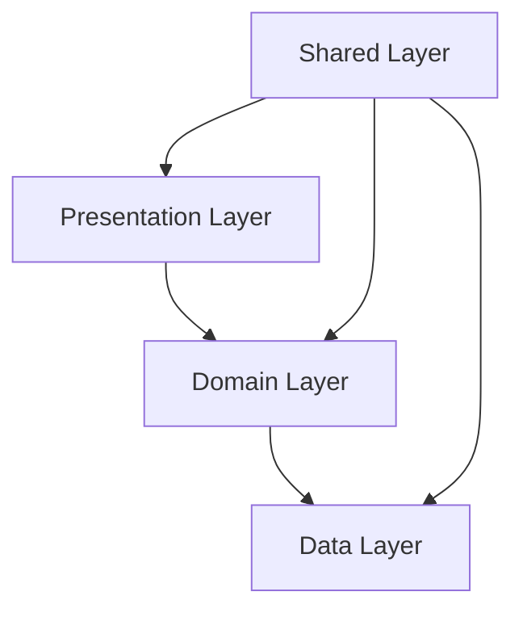

# План архитектуры проекта Finance Dashboard

## Текущая архитектура

На основе анализа кода проект имеет следующую структуру:

```
src/
├── components/          # Компоненты Vue
├── views/               # Страницы приложения
├── router/              # Конфигурация маршрутов
├── stores/              # Хранилище Pinia
├── interface.ts         # Типы TypeScript
├── main.ts              # Точка входа приложения
```

Основные проблемы текущей архитектуры:
1. Бизнес-логика размазана по компонентам
2. Отсутствует четкое разделение на слои
3. Логика работы с данными находится в компонентах
4. Нет четкой структуры для масштабирования

## Предлагаемая архитектура по Clean Architecture

```
src/
├── presentation/        # Слой представления
│   ├── components/      # Переиспользуемые компоненты
│   ├── views/            # Страницы приложения
│   └── composables/     # Vue Composition API функции
├── domain/              # Бизнес-логика
│   ├── entities/        # Бизнес-сущности
│   ├── use-cases/       # Бизнес-правила
│   └── interfaces/       # Интерфейсы для работы с данными
├── data/                # Слой доступа к данным
│   ├── repositories/    # Реализация интерфейсов
│   ├── datasources/     # Работа с внешними API
│   └── models/          # Модели данных
├── shared/              # Общие модули
│   ├── constants/       # Константы
│   ├── utils/           # Вспомогательные функции
│   └── types/          # Общие типы
├── router/              # Конфигурация маршрутов
└── main.ts              # Точка входа приложения
```

## Описание слоев

### 1. Presentation Layer (Слой представления)
Отвечает за отображение информации пользователю и обработку пользовательского ввода.

Компоненты:
- Vue компоненты (UI)
- Страницы приложения
- Composition API функции для работы с состоянием

Зависимости: зависит от Domain слоя

### 2. Domain Layer (Слой бизнес-логики)
Содержит всю бизнес-логику приложения, независимую от фреймворков.

Компоненты:
- Бизнес-сущности (Entities)
- Бизнес-правила (Use Cases)
- Интерфейсы для работы с данными (Repository Interfaces)

Зависимости: не зависит от других слоев

### 3. Data Layer (Слой доступа к данным)
Реализует интерфейсы из Domain слоя и работает с внешними источниками данных.

Компоненты:
- Реализации репозиториев
- Работа с Firebase
- Модели данных

Зависимости: зависит от Domain слоя

### 4. Shared Layer (Общий слой)
Содержит общие модули, используемые всеми другими слоями.

Компоненты:
- Константы
- Вспомогательные функции
- Общие типы

Зависимости: не зависит от других слоев

## Диаграмма архитектуры



## План рефакторинга

1. Создать структуру папок по новой архитектуре
2. Перенести существующие типы в shared/types
3. Создать бизнес-сущности в domain/entities
4. Вынести бизнес-логику из компонентов в use cases
5. Создать интерфейсы репозиториев
6. Реализовать репозитории в data слое
7. Адаптировать компоненты под новую структуру

## Преимущества новой архитектуры

1. Четкое разделение ответственности
2. Упрощенное тестирование
3. Легкость поддержки и масштабирования
4. Независимость бизнес-логики от фреймворка
5. Повторное использование кода